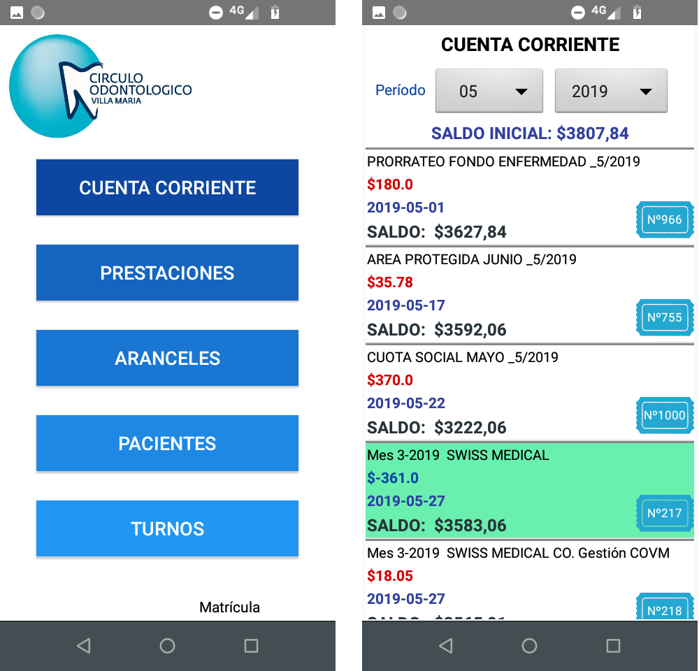
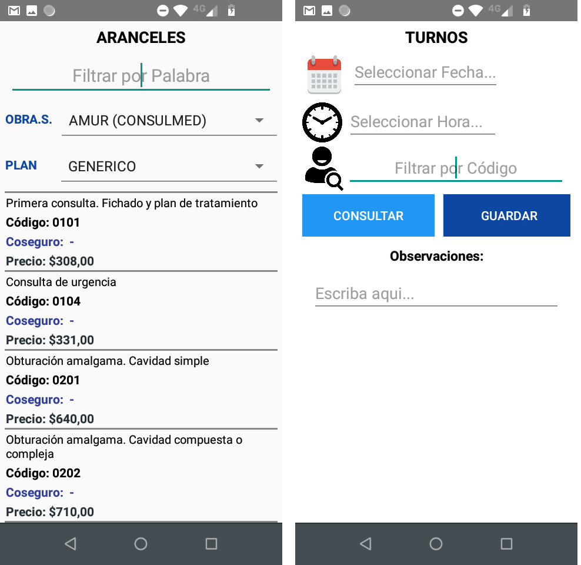

<h1 align="center">App para Gestión de Prestaciones</h1>

  

<strong>

El sistema combina servicios desarrollados en PHP, los cuales se alojan en un servidor remoto, se encargan de administrar la conexión con la base de datos (Mysql). El flujo del programa se describe a continuación:

1) La aplicación de Android envía una solicitud HTTP a un servidor web que ejecuta PHP.
2) El servidor PHP procesa la solicitud y se comunica con la base de datos MySQL para recuperar o almacenar datos.
3) PHP devuelve los datos solicitados a la aplicación de Android en formato JSON.
4) La aplicación de Android recibe los datos JSON y los procesa para mostrarlos en la interfaz de usuario

Esta App en particular está desarrollada para la gestión de profesionales del rubro Odontológico, mediante la App pueden consultar liquidaciones de sus prestaciones, datos de aranceles, cartera de clientes, agendar eventos, entre otras funciones

  </strong>

  

## ENLACE DE LA APP EN GOOGLE PLAY -> [IR A Google Play Store](https://play.google.com/store/apps/developer?id=Uno+Nuevas+Tecnolog%C3%ADas+SRL&hl=es)

